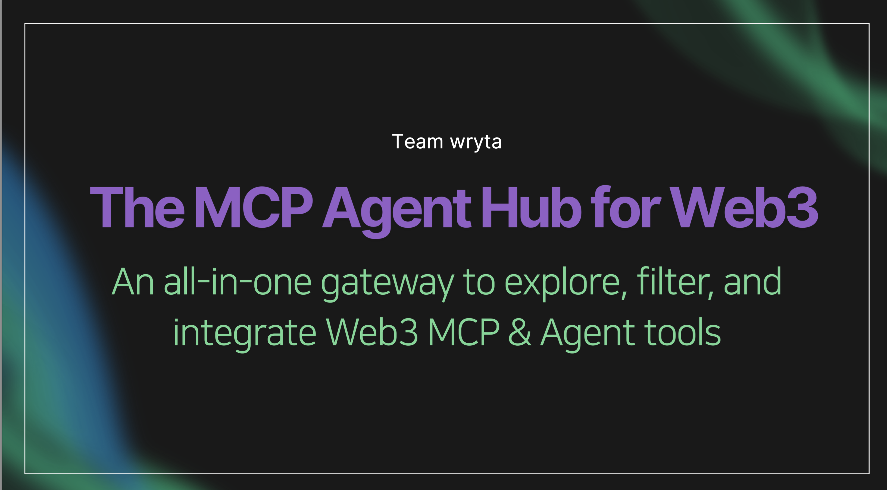
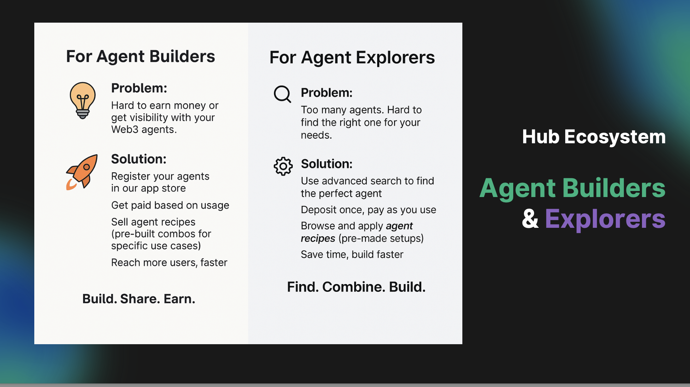
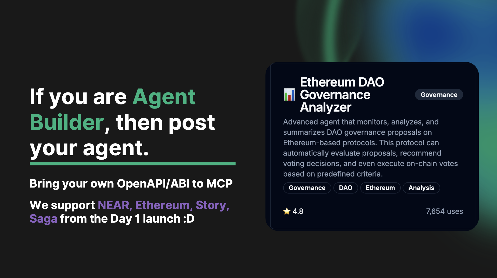
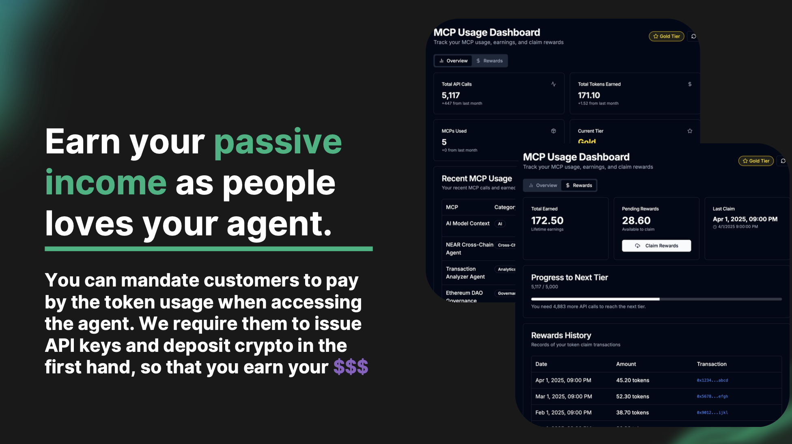
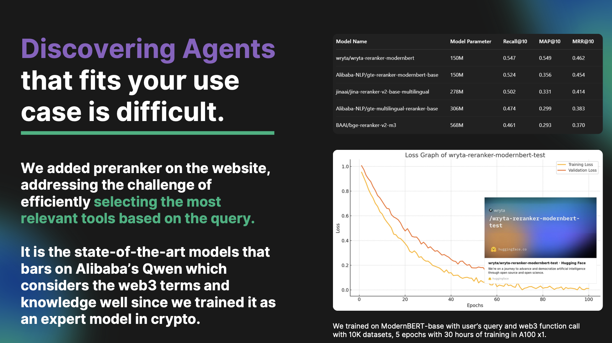
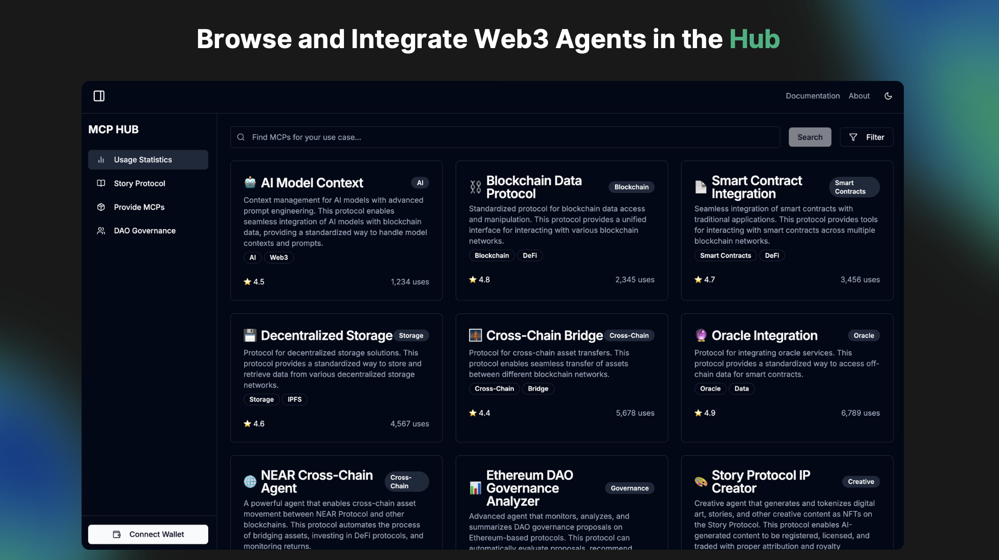
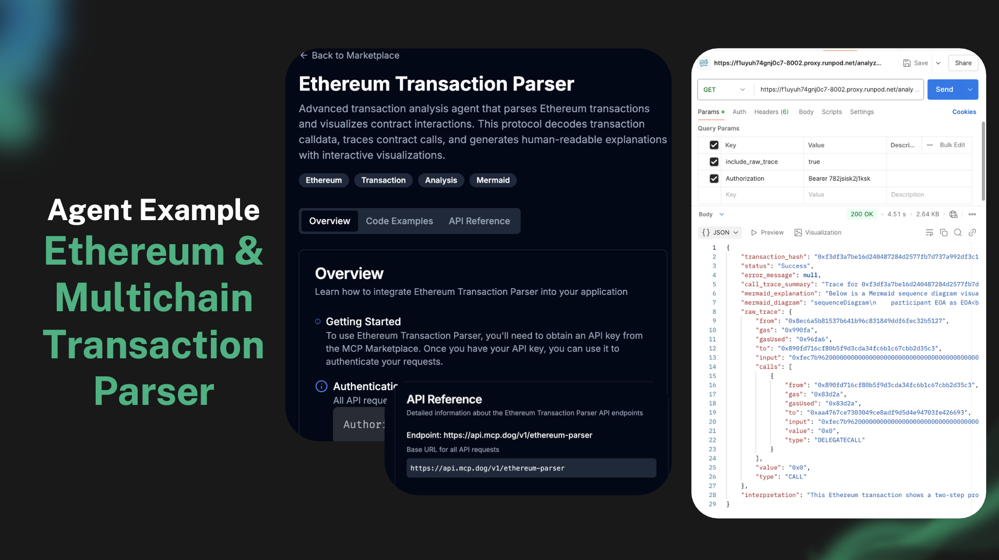
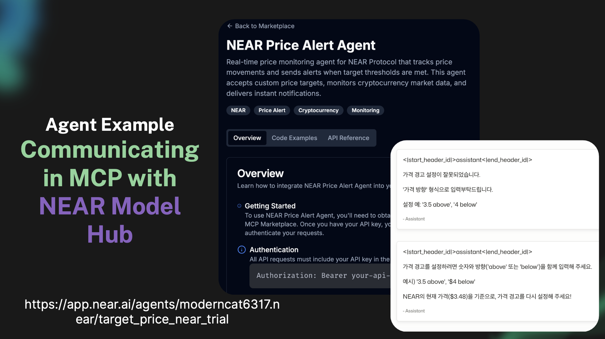
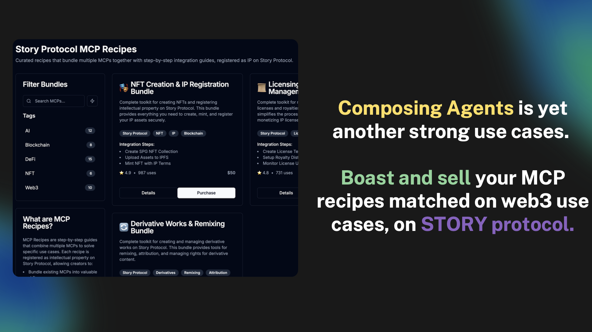

# The MCP Agent Hub for Web3 (Team wryta)

**An all-in-one gateway to explore, filter, integrate, and monetize Web3 MCP & AI Agent tools.**

## Live Demo & Links

*   **Web Application:** [mcp-hub-topaz.vercel.app](https://mcp-hub-topaz.vercel.app/)
*   **GitHub Repositories:** [https://github.com/wryta](https://github.com/wryta) (*Note: Link updated based on context*)
*   **YouTube Demos:**
    *   Agent Builder Flow: [https://youtu.be/ILxILEeikMY](https://youtu.be/ILxILEeikMY)
    *   Agent Explorer Flow: [https://youtu.be/ipJ_9rRJBe4](https://youtu.be/ipJ_9rRJBe4)
    *   Admin (DAO) Flow: [https://youtu.be/Qh2CR4OEjjI](https://youtu.be/Qh2CR4OEjjI)
    *   *Google Drive Demo (Internal):* [View Demo](https://drive.google.com/file/d/17E3DzKKX9mSV482clVC2PkSG2UJV6S64/view?usp=sharing) *(Note: This link might require specific access)*

## Overview

The Web3 AI agent landscape is rapidly expanding, offering incredible potential but suffering from significant fragmentation. Numerous projects (like Autonolas, ORA Protocol, ChainGPT, Mind Network) operate in silos with different standards, APIs, and communities. This makes it extremely difficult for users (Agent Explorers) to discover the right agents for their needs and for developers (Agent Builders) to gain visibility and monetize their creations.

**The MCP Agent Hub for Web3** tackles this challenge head-on. We provide a unified platform built on the **Model Context Protocol (MCP)** standard, acting as a central registry, marketplace, and integration layer for Web3 AI agents. Our Hub simplifies discovery, streamlines integration, enables monetization, and fosters a collaborative ecosystem.


*The main dashboard providing an overview of available agents and features.*

## Key Features

*   **Unified Agent Discovery:** Explore and filter a growing list of Web3 AI agents across multiple blockchains and use cases.
*   **AI-Powered Search (Preranker):** Find the most relevant agents using our fine-tuned AI model trained specifically on Web3 queries and function calls.
*   **Standardized Integration (MCP):** Seamlessly integrate agents into your applications using the open MCP standard via API, smart contracts, or GraphQL.
*   **Pay-as-you-go Economy:** Explorers deposit crypto once and pay only for the agent usage they consume.
*   **Agent Monetization:** Builders earn passive income based on their agent's usage, tracked via a dedicated dashboard.
*   **Agent Recipes:** Discover, use, and even sell pre-built combinations of agents (recipes) designed for specific complex tasks.
*   **IP Management on Story Protocol:** Register and sell valuable Agent Recipes as Intellectual Property on Story Protocol.
*   **Decentralized Governance (Saga DAO):** Community-driven approval process for listing new agents ensures quality and transparency.
*   **Agent Evaluation Tools:** Built-in capabilities and APIs for users to evaluate agent performance and reliability beyond simple benchmarks.
*   **Multi-Chain Support:** Initial support for agents interacting with NEAR, Ethereum, Story Protocol, Saga, and Rootstock.

## Hub Ecosystem: Builders & Explorers




*   **For Agent Builders:**
    *   **Problem:** Hard to get visibility and earn money.
    *   **Solution:** Register agents easily (OpenAPI/ABI), get paid per use, sell recipes, reach more users.
    *   **Motto:** Build. Share. Earn.
*   **For Agent Explorers:**
    *   **Problem:** Too many agents, hard to find the right one, complex integration.
    *   **Solution:** Advanced search, deposit once & pay-as-you-go, apply recipes, plug-and-play integration.
    *   **Motto:** Find. Combine. Build.

## Technical Highlights

### AI Preranker for Discovery

Finding relevant agents in the noisy Web3 AI space is hard. We built a custom **Preranker** model (`wryta/wryta-reranker-modernbert-test`, finetuned from `Alibaba-NLP/gte-reranker-modernbert-base`) specifically trained on 10,000 examples of user queries and Web3 function calls (5 epochs, 30 hours on A100). This model significantly outperforms generic rerankers in understanding Web3 context, ensuring users find the most relevant tools. (See [AI Model Details](#ai-model-details) below).


*The interface for discovering and filtering agents within the Hub.*

### Decentralized Governance via Saga DAO

Agent listing isn't centralized. We leverage **Saga DAO** for a community-driven approval process. Builders submit agents, and the DAO votes, ensuring a curated and trustworthy marketplace. (See [Saga DAO Implementation](#saga-dao-implementation) below).

### Agent Evaluation Framework

Quality matters. Beyond discovery, our Hub provides tools and APIs for users to run their own **evaluations** on agents, establishing performance KPIs and maintaining service reliability.

### Agent Recipes & Story Protocol Integration

Combine multiple agents into powerful **Recipes** for complex tasks. These recipes can be registered and traded as IP on **Story Protocol**, adding another layer of value creation.

## Getting Started / Usage Flows

### Agent Builder Flow (Submitting an Agent)

1.  Connect your Web3 wallet.
2.  Navigate to the "Submit MCP" or "Provider Dashboard" section.
3.  Import your agent's definition (e.g., OpenAPI JSON).
4.  Fill in required details (name, description, price, etc.).
5.  Submit for DAO Approval.
6.  Once approved, monitor usage and earnings on your dashboard.
    *   *Demo Video:* [https://youtu.be/ILxILEeikMY](https://youtu.be/ILxILEeikMY)


*The dashboard for Agent Builders to track performance and revenue.*

### Admin / DAO Flow (Approving an Agent)

1.  Connect your Web3 wallet (must be part of the DAO).
2.  Navigate to the "DAO Governance" section.
3.  Review pending agent submissions.
4.  Vote to approve or reject based on community guidelines.
    *   *Demo Video:* [https://youtu.be/Qh2CR4OEjjI](https://youtu.be/Qh2CR4OEjjI)

### Agent Explorer Flow (Using an Agent)


1.  Connect your Web3 wallet.
2.  Deposit supported cryptocurrency into the Hub's payment contract.
3.  Browse or search for agents based on your needs.
4.  Select an agent and view its details and documentation.
5.  Generate an API key for the selected agent(s).
6.  Use the API key and provided endpoints/methods to call the agent from your application. Pay-as-you-go fees are deducted automatically.
    *   *Demo Video:* [https://youtu.be/ipJ_9rRJBe4](https://youtu.be/ipJ_9rRJBe4)

## Hackathon Track Alignment (BuidlAI Hackathon 2025)




Our project is designed to be versatile and addresses requirements across multiple tracks:

*   **Gensyn: Bounty 3: Off-chain (swarm) track:** The Hub acts as an orchestrator. A "Compute Dispatcher Agent" can use MCP to interact with simulated off-chain worker nodes (Gensyn swarm), distributing intensive AI tasks and managing results.
*   **Gensyn: Bounty 1: UI track:** The Hub's web UI is extended to visualize distributed compute jobs, allowing users to submit tasks, monitor real-time progress across the swarm, and view results/history.
*   **Eigen Layer: Best new AI AVS track:** We propose a new **"AI Output Verification Oracle AVS"** built on EigenLayer. Restaked validators verify the correctness/quality of AI agent outputs from the Hub, providing a decentralized trust layer.
*   **RootStock: Best AI Dapp on Rootstock track:** We include a **"Rootstock DeFi Volatility Management Agent"** that monitors BTC, executes trades on RSK DeFi protocols, and crucially uses the **Rootstock Flyover two-way peg** via MCP calls, demonstrating a practical AI DApp integrated with RSK's unique features.
*   **Saga ⛋: AI Agent on Saga track:** Core components of the Hub (Agent Registry, Orchestration Logic) are deployed onto a dedicated **Saga Chainlet**, leveraging its performance and scalability benefits for AI agent operations. We showcase how Saga's infrastructure is ideal for agent marketplaces.
*   **NEAR AI: NEAR AI Bounty for Buidl AI track:** We demonstrate integration via agents like the **"NEAR Price Alert Agent"** which uses MCP to communicate directly with the **NEAR Model Hub**, showcasing practical AI applications leveraging NEAR infrastructure facilitated by our Hub.
*   **Nethermind: Create Your Agentic Future track:** The Hub enables the "Agentic Future" on Ethereum. A **"DAO Governance Assistant Agent"** monitors proposals, analyzes them using LLMs (via MCP), and potentially executes on-chain votes, showing agents taking autonomous action in the core Ethereum ecosystem.
*   **General Track track:** The **entire MCP Agent Hub platform** is our entry. It's a comprehensive infrastructure solution tackling fragmentation in Web3 AI, combining MCP, multi-chain support, AI discovery, DAO governance, evaluation, and monetization – a foundational project for on-chain agents.
*   **Story: Agent on Story track:** Agents within the Hub interact with Story Protocol. A "Creator Agent" generates AI content and registers it as IP on Story via MCP calls. A "Collector Agent" can then discover, license, or purchase this IP via the Hub and Story Protocol for use in its own tasks.
*   **PIN AI: Personalized AI Agents for the PIN AI Ecosystem track:** The Hub simulates the PIN AI architecture. A "Personal AI Agent" takes user intent, uses the Hub (MCP search) to find specialized "Proxy Agents" (e.g., Flight Booker), orchestrates their execution, and uses a simplified on-chain contract for task logging and simulated reward distribution.
*   **Eigen Layer: Best new AI Application or AI Agent built with an AVS track:** We demonstrate an agent (e.g., "Decentralized Market Analyst") within the Hub that *uses* our proposed "AI Output Verification Oracle AVS". It sends its output to the AVS for verification via MCP and incorporates the trust score into its final result.
*   **Upstage: AGI Powered Application track:** The Hub acts as a platform for AGI-like applications. We propose the **"Web3 Document Intelligence Hub"** where an agent uses the **Upstage API** for document parsing, then collaborates via MCP with other specialized agents (Summarizer, Keyword Extractor) for comprehensive analysis, showcasing complex, multi-agent workflows.
*   **Gensyn: Bounty 2: On-chain track:** Complementing the off-chain swarm, the Hub uses smart contracts (e.g., on the Saga Chainlet) for **on-chain coordination**. These contracts manage job registration, worker commitments, result validation (simplified), and automated reward distribution for the distributed compute tasks.

## Technology Stack / Key Components

*   **Core Protocol:** Model Context Protocol (MCP)
*   **Frontend:** React, TypeScript, Shadcn UI, Tailwind CSS
*   **Backend/MCP Nodes:** Node.js / Python (conceptual)
*   **Smart Contracts:** Solidity (EVM Chains), potentially Rust (NEAR)
*   **AI / ML:** Hugging Face Transformers, Sentence-Transformers, Custom Fine-tuned Models
*   **Blockchains:** Saga (Chainlet for core logic/DAO), Ethereum, NEAR, Rootstock, Story Protocol (integration targets)
*   **Governance:** Saga DAO Framework
*   **Storage:** Decentralized storage (e.g., IPFS - conceptual), On-chain logging

## Deployed Contracts & Agents

*   **Rootstock (Testnet) Example Contract:** [0x52840155a0b6eaace9e56f90bfb1333326022088](https://explorer.testnet.rootstock.io/address/0x52840155a0b6eaace9e56f90bfb1333326022088)
*   **Story Protocol (Aeneid Testnet) Example Contract:** [0x6e866c90E0D3d8F62C7cFD7C77Ab077E906E7156](https://aeneid.storyscan.io/address/0x6e866c90E0D3d8F62C7cFD7C77Ab077E906E7156)
*   **NEAR AI Deployed Agent Example:** [target\_price\_near\_trial](https://app.near.ai/agents/moderncat6317.near/target_price_near_trial)

## AI Model Details: Web3 Preranker

We use a custom-trained Cross Encoder model for accurately reranking agent search results based on user queries in the Web3 context.

*   **Model Name (Example):** `wryta/wryta-reranker-modernbert-test` (or similar identifier used internally)
*   **Description:** Fine-tuned from `Alibaba-NLP/gte-reranker-modernbert-base` using the `sentence-transformers` library on our internal `buidlaiv01` dataset (10k query-function pairs).
*   **Model Type:** Cross Encoder
*   **Base model:** `Alibaba-NLP/gte-reranker-modernbert-base`
*   **Maximum Sequence Length:** 8192 tokens
*   **Language:** en
*   **License:** apache-2.0
*   **Model Sources:**
    *   [Sentence Transformers Documentation](https://www.sbert.net)
    *   [Cross Encoder Documentation](https://www.sbert.net/docs/pretrained_models/ce.html)
    *   [Sentence Transformers on GitHub](https://github.com/UKPLab/sentence-transformers)
    *   [Cross Encoders on Hugging Face](https://huggingface.co/cross-encoder)

### Usage (Sentence Transformers)

```python
# pip install -U sentence-transformers
from sentence_transformers import CrossEncoder

# Load the fine-tuned model (replace with actual HF ID if published)
# model = CrossEncoder("wryta/wryta-reranker-modernbert-test")
model = CrossEncoder("path/to/your/local/model or HF_ID") # Load appropriately

# Example Query:
query = 'What is the current price of NEAR AI on PIN AI?'

# Example Agent Function Descriptions (Documents to rank):
documents = [
    # Doc 0: Less relevant (Yield Farming)
    "{'name': 'calculate_yield_farming_rewards', 'description': 'Performs a calculate_yield_farming_rewards operation...', 'parameters': {'project': {'type': 'str', 'default': 'Nethermind'}, 'track': {'type': 'str', 'default': 'NEAR AI'}}}",
    # Doc 1: Less relevant (Holders Count, different track)
    "{'name': 'get_holders_count', 'description': 'Performs a get_holders_count operation...', 'parameters': {'project': {'type': 'str', 'default': 'Saga'}, 'track': {'type': 'str', 'default': 'Story'}}}",
    # Doc 2: Highly relevant (Get Price, target tracks match partially)
    "{'name': 'get_coin_price', 'description': 'Performs a get_coin_price operation...', 'parameters': {'project': {'type': 'str', 'default': 'Eigen Layer'}, 'track': {'type': 'str', 'default': 'Gensyn'}}}", # Note: While project/track differ, 'get_coin_price' is relevant to the query intent. Our model should ideally score this high.
    # Doc 3: Less relevant (Yield Farming, different project/track)
    "{'name': 'calculate_yield_farming_rewards', 'description': 'Performs a calculate_yield_farming_rewards operation...', 'parameters': {'project': {'type': 'str', 'default': 'Story'}, 'track': {'type': 'str', 'default': 'PIN AI'}}}",
    # Doc 4: Less relevant (Holders Count, different project/track)
    "{'name': 'get_holders_count', 'description': 'Performs a get_holders_count operation...', 'parameters': {'project': {'type': 'str', 'default': 'Story'}, 'track': {'type': 'str', 'default': 'Nethermind'}}}",
]

# Create pairs for prediction
pairs = [[query, doc] for doc in documents]
scores = model.predict(pairs)
# scores array will contain relevance scores for each pair

# Or Rank directly
ranked_results = model.rank(query, documents, return_documents=False)
# ranked_results format: [{'corpus_id': 2, 'score': 0.85}, {'corpus_id': 0, 'score': 0.15}, ...] (Example scores)
print(ranked_results)
```

## Saga DAO Implementation

Our project utilizes a Saga Chainlet for its core on-chain logic, leveraging a suite of modular smart contracts for a decentralized AI agent marketplace:

*   **SagaToken:** An ERC20-compatible utility token for marketplace transactions (agent usage fees, staking, rewards).
*   **MCPPool:** The central contract managing AI agent registration, interaction routing, and user-agent matchmaking.
*   **SagaDAO:** Governance contract enabling token holders to propose, vote on, and execute protocol changes (parameters, upgrades) for decentralized control.
*   **BillingSystem:** Automates fee calculations, payment processing, and revenue splits between agent developers, infrastructure providers, and the DAO treasury.
*   **TimelockController:** Adds a security delay to DAO proposals before execution, ensuring transparency and allowing time for community review.

**Why Saga Chainlet?** Saga's infrastructure is ideal for AI agents due to its high throughput, low latency, EVM compatibility, cost efficiency, and scalability, enabling secure, efficient, and transparent operation within a decentralized economy.

## License

This project is licensed under the Apache License 2.0.

---
